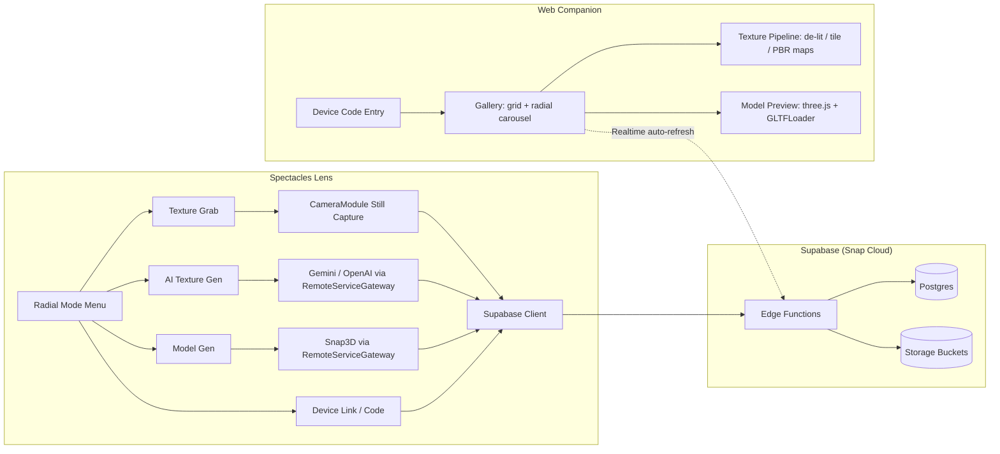

# Asset Forge

**Scan the world, or dream one up. Either way, it lands in a shareable asset library.**

Asset Forge is a Snap Spectacles Lens for building a personal library of PBR textures and 3D models on the go. Pinch-frame a real-world surface and it becomes a tileable material; speak or type a prompt and Gemini/OpenAI paint a texture or Snap3D sculpts a mesh instead. Everything a device captures or generates streams to a Supabase-backed relay, where a companion web app turns raw captures into full PBR map sets (BaseColor/Normal/Roughness/AO/Height), previews 3D models, and hands out downloadable ZIPs and `.glb` files.

No account signup on-device — each headset gets a persistent, human-readable device code that links its library to the web companion.

## What It Feels Like

```txt
open the Lens, pick a mode from the radial menu
Texture Grab  -> pinch both hands, frame a real surface, release to capture
AI Gen        -> tap the mic (or type) a prompt -> Gemini/OpenAI paints a texture
Model Gen     -> tap the mic (or type) a prompt -> Snap3D sculpts a mesh in-world
Code          -> shows this device's link code (auto-opens on first-ever launch)
pinch Confirm on any capture/generation -> uploads to your library
open the web companion, enter your device code, browse everything you made
```

Every mode shares one upload pipeline: capture or generate on-device, preview it, confirm or discard, and it shows up in the companion app moments later via Supabase Realtime.

## Feature Snapshot

| Area | Current Support |
| --- | --- |
| Texture Grab | Pinch-both-hands framing gesture, hand-tracked crop rectangle, high-res still capture, JPEG upload |
| AI Texture Gen | Voice (shared ASR session) or typed prompt, Gemini `gemini-2.5-flash-image` primary, OpenAI `gpt-image-1` automatic fallback |
| Model Gen | Voice or typed prompt, Snap3D base + refined mesh stages, in-world preview before confirming, Push/Discard buttons |
| Device Linking | Persistent per-device code (idempotent, generated once), auto-surfaced on first-ever Lens launch |
| Mode Menu | Radial-style menu toggling Texture/Model/AI-Gen/Code roots; modes keep running in the background when hidden |
| Web Companion | Single-file gallery (grid + radial carousel), realtime auto-refresh, device-code-scoped library |
| Texture Pipeline | De-lit, tiled (wrap + feather), and mapped (5 PBR maps) processing entirely client-side in the browser |
| Model Pipeline | glTF preview via three.js, `.glb` download |
| Library Management | Multi-select + bulk delete across textures and models |
| Backend | Supabase (via Snap Cloud) Edge Functions + Postgres + Storage, all server secrets pulled from environment, never hardcoded |

Not yet implemented:

- per-engine ready-to-use export packaging (Unity/Unreal/Maya specific) — explicitly out of scope
- collaborative/shared libraries across multiple linked devices
- live mesh-render thumbnails for generated models (placeholder glyph today)

## Architecture



## Repository Layout

```txt
Asset Forge/
├── Assets/
│   ├── Scripts/
│   │   ├── TextureGrab.ts              pinch-frame-capture mode
│   │   ├── GeminiTextureGenerate.ts     voice/text -> AI texture mode
│   │   ├── Snap3DVoiceGenerate.ts       voice/text -> AI 3D model mode
│   │   ├── LensModeSelect.ts            radial mode menu / mode-root toggling
│   │   ├── DeviceLinkController.ts      device-code display + retry
│   │   ├── ASRQueryController.ts        shared speech-to-text session
│   │   ├── DeviceId.ts                  persistent per-device id
│   │   └── FlavorTextRotator.ts         rotating "still working…" status text
│   ├── ImageAnchor.lspkg/               camera + screen-space tracking helper
│   └── ...                              materials, meshes, UI prefabs
├── Packages/                            SpectaclesInteractionKit, RemoteServiceGateway,
│                                         SupabaseClient, SpectaclesUIKit, and friends
├── supabase/
│   ├── functions/                       upload, upload-model, list, list-models,
│   │                                    grab, delete, device-code, seamless-gemini
│   └── migrations/                      grabs, models, accounts, realtime, device_codes
├── web/
│   └── index.html                       single-file gallery + texture/model pipeline
├── Asset Forge.esproj                   Lens Studio project
├── CHANGELOG.md
└── README.md
```

## Quick Start

### 1. Create a Supabase Project (via Snap Cloud)

1. In Lens Studio, install the Snap Cloud / Supabase plugin and provision a project (or bring your own Supabase project).
2. Note the **Project URL** and **anon public key** — Snap Cloud projects resolve on `<ref>.snapcloud.dev`, not the standard `<ref>.supabase.co` domain.
3. Run the SQL in `supabase/migrations/` (in order) via the dashboard's SQL Editor.
4. Paste each function under `supabase/functions/*/index.ts` into the dashboard's Edge Functions "Via Editor" — they're intentionally self-contained (no relative imports) for exactly this.
5. Set the required secrets in the Edge Functions dashboard: `SUPABASE_SERVICE_ROLE_KEY`, `SUPABASE_URL`, and (for `seamless-gemini`) `GOOGLE_AI_STUDIO_KEY`.
6. Create the `models` Storage bucket as a public bucket (used by `upload-model`).

### 2. Configure the Lens

1. Open `Asset Forge.esproj` in Lens Studio (5.15.4+, targeting Spectacles).
2. Drag your Supabase Project credentials asset into every script's **Supabase Project** input (`TextureGrab`, `GeminiTextureGenerate`, `Snap3DVoiceGenerate`, `DeviceLinkController`).
3. Install `RemoteServiceGateway.lspkg` from the Asset Library if not already present, and configure its credentials for Gemini/OpenAI/Snap3D access.
4. Push to Spectacles via Interactive Preview, or publish the Lens.

### 3. Host the Web Companion

`web/index.html` is a single self-contained file (three.js, JSZip, and the Supabase JS client loaded from CDN, no build step). Deploy it anywhere that serves static files — drag-and-drop onto a static host works fine. Update the Supabase URL/anon key constants at the top of the file to match your project.

### 4. Link a Device

On first launch, the Lens's Code mode opens automatically with your device's link code. Enter that code on the web companion to scope the gallery to that device.

## Developer Notes

- [Contributing](CONTRIBUTING.md)
- [Changelog](CHANGELOG.md)

Each Supabase Edge Function under `supabase/functions/` carries a header comment explaining its role and why it's written as a single self-contained file (so it pastes directly into the Snap Cloud dashboard's editor) — read those before modifying the backend.

## Notes And Risks

Asset Forge is a personal-scale prototype, not a production pipeline. A few real constraints worth knowing before you build on it:

- `CameraModule.requestImage()` (the high-res still capture Texture Grab uses) is device-only — it does nothing in the Lens Studio editor/preview.
- ASR (speech-to-text) and the camera are both "sensitive sensor" APIs on Spectacles and cannot be active at the same time — Texture Grab suspends the shared voice session while it's the active mode.
- Snap Cloud provisions Supabase projects on a `snapcloud.dev` gateway domain, not the usual `supabase.co` one, and the standard Supabase CLI can't manage a Snap Cloud project directly — schema and function changes go through the dashboard.
- The `seamless-gemini` function uses a separate, plain Google AI Studio API key (its own secret), distinct from the Snap-hosted Gemini access the Lens itself uses via `RemoteServiceGateway.lspkg`.
- Google retired the old Vertex AI Imagen endpoint and OpenAI retired DALL-E during this project's lifetime — `GeminiTextureGenerate.ts` targets their current replacements (`gemini-2.5-flash-image`, `gpt-image-1`); expect to revisit model ids again if either provider moves the endpoint again.
